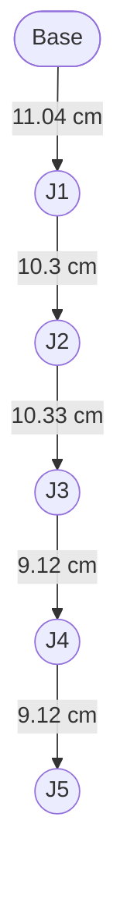
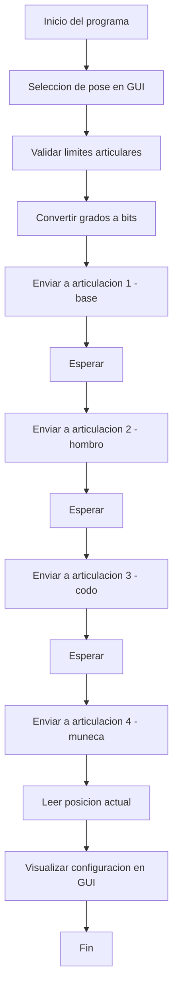
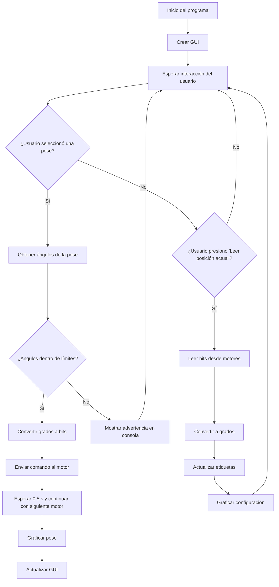

# Laboratorio No 4 Cinematica Directa
**Juliana Gongora Rasmussen**

_Ingeniería Mecatrónica_

Correo: jugongorar@unal.edu.co

---

**Gerhaldine Alejandra Suárez Bernal**
  
  _Ingeniería Mecatrónica_

Correo: gesuarezb@unal.edu.co
## Descripción de la solución planteada

  

Para  la solución plantada se combinaron herramientas de control de hardware, visualización gráfica e interacción de usuario para operar el manipulador Phantom X Pincher utilizando ROS 2, Python y servomotores Dynamixel. El objetivo fue desarrollar un sistema completo que permitiera enviar comandos de posición, visualizar el estado articular del robot y graficar su configuración desde una interfaz intuitiva.
## Tabla DH 

| i | θᵢ (variable) | dᵢ (cm) | aᵢ (cm) | αᵢ (rad) |
|---|---------------|---------|---------|----------|
| 1 | θ₁            | 11.04   | 0       | π/2      |
| 2 | θ₂            | 0       | 10.3    | 0        |
| 3 | θ₃            | 0       | 10.33   | 0        |
| 4 | θ₄            | 0       | 9.12    | 0        |
| 5 | θ₅            | 0       | 9.12    | 0        |

  

### Componentes principales
Control directo con Dynamixel SDK
Se utilizó la biblioteca oficial de Dynamixel (dynamixel_sdk) para establecer comunicación con los servomotores AX-12 a través del puerto /dev/ttyUSB0. El script inicializa cada motor, activa el torque y permite enviar comandos en tiempo real.

### Definición de poses articulares
Se establecieron cinco configuraciones articulares predefinidas. Estas posiciones se expresan en grados y representan distintas poses del brazo robótico. Antes de ejecutar cualquier movimiento, el sistema valida que los ángulos se encuentren dentro de los límites permitidos por cada junta.

### Conversión entre grados y bits
Se implementaron funciones para traducir los valores de ángulos humanos (grados) a valores en bits utilizados por los motores, y viceversa, permitiendo mostrar y recibir información interpretable por el usuario.

### Visualización de la configuración del robot
Se desarrolló una herramienta gráfica usando matplotlib que genera una vista lateral del robot en la pose seleccionada o actual. Esta representación ayuda a verificar visualmente la validez y similitud entre la simulación y la configuración física.

### Interfaz gráfica con Tkinter
Se diseñó una GUI amigable que permite:

- Seleccionar y ejecutar las cinco poses predefinidas.

- Leer la posición actual del robot.

- Visualizar los ángulos de cada articulación.

- Mostrar información del grupo y el logo del laboratorio.
Esta interfaz también puede usarse para tomar capturas o grabar videos de prueba de forma más sencilla.

### Integración con ROS 2
La solución se encapsula en una clase que extiende de rclpy.node.Node, permitiendo su ejecución como un nodo ROS. Aunque el enfoque fue directo y no se usaron controladores avanzados como joint_trajectory_controller, el diseño modular permite escalar fácilmente a una integración más completa en ROS.

## Diagrama de flujo de acciones del robot 

### Diagrama de fluijo del GUI

## Plano de planta de la ubicación de los elementos
Se diseñó una estación de trabajo donde el Phantom X Pincher está fijo sobre una base de madera al centro de la mesa. La fuente de alimentación se encuentra lateralmente, conectada al controlador, y la laptop con ROS 2 se ubica al costado del operador. Una cámara frontal registra los movimientos del robot.

📄 [Ver plano de planta del robot en PDF](plano/Base-Pincher_phantom_X.pdf)

## Descripción de las funciones utilizadas.
El sistema está compuesto por varias funciones y métodos que trabajan juntos para controlar de forma segura el robot, leer sus posiciones en tiempo real y mostrar visualmente cómo se está moviendo.

A continuación, se describen las funciones principales del código.
---

### Funciones de conversión y visualización

#### deg_to_bits(deg)
Esta función transforma un ángulo en grados a su valor equivalente en bits, siendo esta la escala que entienden los motores Dynamixel, esto es  necesario porque los comandos que se envían al hardware no aceptan directamente valores angulares en grados.

#### bits_to_deg(bits)
Realiza la conversión inversa que "deg_to_bits", toma un valor en bits leído desde el motor y lo traduce nuevamente a grados, facilitando la visualización y comprensión de la posición real del actuador.

#### graficar_robot(q)
Permite visualizar la configuración del manipulador en un plano 2D, utilizando la biblioteca `matplotlib`. Recibe como entrada un conjunto de ángulos articulares y genera una gráfica que simula la posición del brazo. 

---

###  Métodos de la clase `ArticulationController`

#### __init__(self)
Es el método constructor de la clase. Se encarga de:

- Configurar la conexión con los motores 
- Habilitar el torque para permitir el movimiento
- Inicializar variables internas para guardar posiciones articulares
- Llamar a `create_gui()` para generar la interfaz gráfica de usuario 

#### move_to_pose(self, pose_name)
Permite mover el robot hacia una de las cinco poses definidas. El flujo incluye:

- Obtener los ángulos asociados a la pose seleccionada.
- Verificar que cada ángulo esté dentro de los límites permitidos para cada articulación.
- Convertir cada ángulo a bits.
- Enviar los comandos a cada motor uno a uno, con una pausa intermedia para permitir observar el movimiento.
- Graficar la nueva configuración del robot.

#### read_angles(self)
Consulta a cada motor cuál es su posición actual, transforma esos valores a grados y los guarda para ser visualizados en pantalla. Además, genera la gráfica del estado actual. Esta función permite conocer la posición actual del robot de manera grafica.

#### update_joint_labels(self)
Actualiza los textos de la interfaz gráfica que muestran los valores actuales de cada articulación. Esto permite al usuario monitorear en tiempo real los ángulos del robot.

---

### Funciones de interfaz gráfica

#### `create_gui(self)`
Construye toda la ventana gráfica usando `tkinter`, incluyendo:

- Encabezado con el nombre del curso y integrantes
- Carga del logo 
- Botones para seleccionar las cinco poses disponibles
- Botón para leer la posición actual del brazo
- Área donde se muestran los valores articulares actuales

---

### Función principal

#### `main()`
Inicializa el nodo ROS 2, ejecuta la lógica de la clase `ArticulationController`, y al finalizar la ejecución, cierra correctamente el nodo. 
## Vídeo

